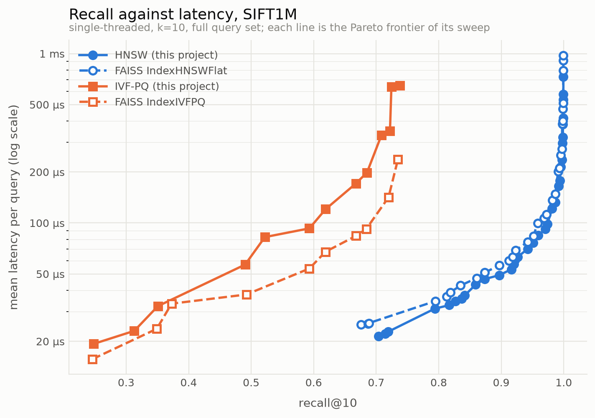
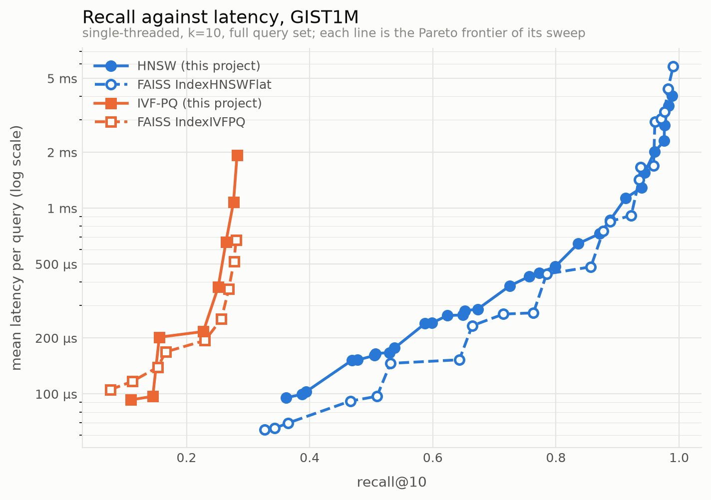
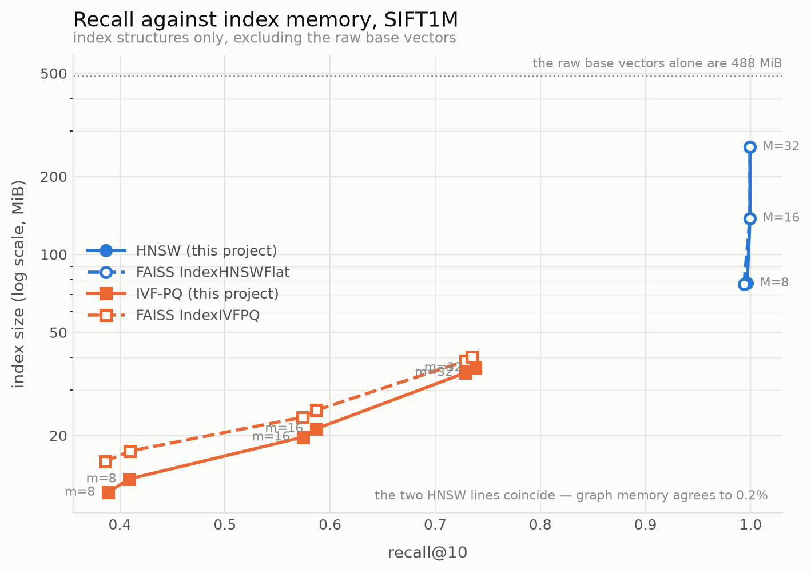
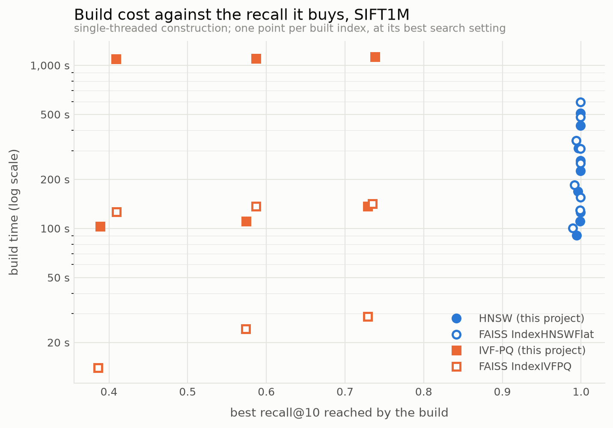

# ann-java

**HNSW and IVF-PQ written from scratch in Java 21, benchmarked against FAISS on SIFT1M and
GIST1M under a protocol frozen before either index was written.**

The headline: on SIFT1M this HNSW reaches **recall@10 of 0.9920 in 165 µs per query**
single-threaded — matching the exact answer on 99.2% of neighbours over a million vectors —
and beats `IndexHNSWFlat` on latency at all 36 swept configurations while computing 2% *more*
distances. On GIST1M at 960 dimensions that advantage inverts at low degree and survives only at
M=32, and the more useful result is why: **this implementation's bookkeeping is faster and
its distance kernel is slower**, so which one wins depends on how much arithmetic sits behind
each candidate.

> **These numbers are aarch64-specific.** Measured on an Apple M4 Pro, where both sides get
> 128-bit vectors — 4 float lanes. On an x86 host with AVX-512, FAISS's hand-written
> intrinsics get 16 lanes against the same 4 the JDK Vector API offers, and the latency
> comparisons would plausibly reverse. The *methodology* travels; the ratios may not.

The goal was never to beat FAISS — it is years of C++ and hand-tuned SIMD by a team. It was
to land in the same neighbourhood and be able to point at exactly where the remaining gap is.

---

## The curves

Blue is HNSW, orange is IVF-PQ; solid is this project, dashed is FAISS. Each line is the
Pareto frontier of its sweep.

<picture>
  <source media="(prefers-color-scheme: dark)" srcset="docs/plots/recall-latency-sift1m-dark.png">
  
</picture>

SIFT1M. The solid blue line is below the dashed one — faster at every recall. The solid
orange is above — slower at every recall. **This project wins the graph index and loses the
quantized one.** Note also where orange stops: IVF-PQ cannot be pushed past ≈0.74 at these
code sizes however much latency it is given, while blue runs to the 0.9994 ceiling. That wall
is quantization error, not search effort.

<picture>
  <source media="(prefers-color-scheme: dark)" srcset="docs/plots/recall-latency-gist1m-dark.png">
  
</picture>

GIST1M, 960 dimensions, same code and same grid. The orange lines now terminate at ≈0.28 —
IVF-PQ returns barely a quarter of the true neighbours and no `nprobe` recovers it. Blue
still reaches 0.988. **The two index families do not degrade alike.**

<picture>
  <source media="(prefers-color-scheme: dark)" srcset="docs/plots/recall-memory-sift1m-dark.png">
  
</picture>

The families barely compete on memory. IVF-PQ spans 12–37 MiB; HNSW spans 77–260 MiB **and
needs the 488 MiB of raw vectors on top**, because it computes real distances during the
search. The two HNSW lines are one visible line: the implementations agree to 0.2%.

<picture>
  <source media="(prefers-color-scheme: dark)" srcset="docs/plots/build-recall-sift1m-dark.png">
  
</picture>

One point per built index — a scatter, since joining builds that differ in `M` or `nlist`
would draw a trajectory nothing travels along. The two implementations diverge here most
sharply and in opposite directions: HNSW builds **1.09–1.23x faster** here, IVF-PQ builds
**4.6–8.7x slower**.

---

## Results

Cheapest configuration reaching each recall target, each side at its own best settings.

**SIFT1M** — 1M × 128, the full 10,000-query set, k=10, single-threaded.

| target | index | configuration | recall@10 | mean latency | FAISS | index size |
|---|---|---|---:|---:|---:|---:|
| ≥0.90 | HNSW | M=16, efC=200, ef=32 | 0.9160 | **53 µs** | 60 µs | 138 MiB |
| ≥0.95 | HNSW | M=32, efC=400, ef=32 | 0.9514 | **76 µs** | 84 µs | 260 MiB |
| ≥0.99 | HNSW | M=16, efC=200, ef=128 | 0.9920 | **165 µs** | 201 µs | 138 MiB |
| max | HNSW | M=32, efC=400, ef=512 | **0.9994** | 732 µs | 732 µs | 260 MiB |
| max | IVF-PQ | nlist=4096, m=32, nprobe=64 | 0.7380 | 649 µs | 268 µs | **36.5 MiB** |
| — | exact brute force | — | 0.9994 | ~14 ms | — | — |

**GIST1M** — 1M × 960, **the full 1,000-query set shipped with GIST1M**, k=10,
single-threaded. (SIFT1M ships 10,000 queries and GIST1M ships 1,000; both tables use
the whole shipped set, and both sides of each comparison use the same one.)

| target | index | configuration | recall@10 | mean latency | FAISS | index size |
|---|---|---|---:|---:|---:|---:|
| ≥0.90 | HNSW | M=32, efC=200, ef=128 | 0.9132 | 1134 µs | **914 µs** | 260 MiB |
| ≥0.95 | HNSW | M=32, efC=200, ef=256 | 0.9602 | 2013 µs | **1695 µs** | 260 MiB |
| max | HNSW | M=32, efC=400, ef=512 | 0.9884 | 4037 µs | 4388 µs | 260 MiB |
| max | IVF-PQ | nlist=4096, m=32, nprobe=64 | **0.2821** | 1932 µs | 1897 µs | 50.3 MiB |

**0.999440 and 0.999200 are the ceilings, not 1.0.** The datasets contain vectors equidistant
from a query, so the top-10 *ids* are not unique — see below. HNSW reaches the SIFT ceiling
exactly.

---

## Analysis

### The recall ceiling is not 1.0, and for two different reasons

Exact brute-force search was validated against the ground truth shipped with each dataset.
All 10,000 SIFT queries and all 1,000 GIST queries return a distance sequence no worse than
the shipped one, with **zero queries where the search returned a vector genuinely farther**.
That — not an id-for-id match — is the well-defined statement of exactness, because ids are
not unique:

* **SIFT ties are exact.** Query 93 has base vectors 196106 and 274922 both at squared
  distance 42192.0, and that is not rounding: components are integers in [0,255], so every
  squared distance is an integer below 2²⁴ and float32 holds it exactly. 646 queries
  disagree on ids this way. **Ceiling: 0.999440.**
* **GIST ties are unresolvable rather than equal.** Summing 960 squared differences in
  float32 accumulates relative error around `√960·ε ≈ 1.9e-6`, and for query 697 the gap
  between the 10th and 11th neighbours is 7e-6 — smaller than the arithmetic can resolve.
  **Ceiling: 0.999200.**

The comparison is therefore tolerance-based and one-sided: finding something *closer* than
the ground truth names is never an error.

### Where the FAISS gap comes from — three gradients, not one number

Beating FAISS is not a credible outcome for a from-scratch implementation, so it was treated
as a defect in the comparison until it survived three checks:

1. **The graphs are the same size.** Corrected for the `IndexFlat` that `IndexHNSWFlat`
   embeds, FAISS's graph is 137.6 MiB at M=16 against this project's 137.9 — 0.2% apart, and
   within 0.7% at every M.
2. **The searches do the same work.** `hnsw_stats.ndis` per query at M=16/efC=200: 518 vs
   514 at ef=16, 6,942 vs 6,781 at ef=512. **This implementation computes ~2% *more*
   distances and is still faster** — and that also explains its slightly higher recall.
3. **FAISS is not a crippled build.** The wheel reports `OPTIMIZE DD ARM_NEON MAC_METAL`
   with the full ASIMD instruction set.

What is left is execution efficiency, and it has three independent gradients. Mean-latency
ratio, this project ÷ FAISS, on GIST1M:

| ef | M=8 | M=16 | M=32 |
|---:|---:|---:|---:|
| 16 | 1.49 | 1.35 | 1.07 |
| 64 | 1.47 | 1.28 | 0.98 |
| 512 | 1.30 | 1.26 | **0.82** |

On SIFT1M the same ratio runs 0.63–0.90 everywhere. So GIST does not simply flip the
result — at M=32 this project is still level or ahead (0.82 at ef=512, and 4037 µs against
4388 at the maximum-recall setting). It is the same three-gradient story, with dimension
pushing one way and `M` and `efSearch` pushing the other:

* **↑ dimension → FAISS gains.** More arithmetic per candidate, bookkeeping unchanged. The
  distance kernel is theirs.
* **↑ efSearch → this project gains.** More candidates through the visited stamps and the two
  heaps. That bookkeeping is this project's, bought by steps 2 and 3 below.
* **↑ M → this project gains.** More pending neighbours per hop for the step-5 software
  prefetch to issue together, and at 960 dimensions each miss costs 3,840 bytes.

Running both datasets is what separates these. Sweeping `M` alone would confound kernel work,
hop count and cache behaviour at once; sweeping *dimension* at fixed `M` and `ef` moves the
kernel/bookkeeping ratio while leaving graph structure and beam mechanics alone.

### What breaks at 960 dimensions

Full treatment in [docs/analysis.md](docs/analysis.md). The short version:

**IVF-PQ collapses and HNSW does not.** Best recall falls 0.9994 → 0.9884 for HNSW (−1.1
points) and 0.7380 → 0.2821 for IVF-PQ (−45.6). FAISS loses the same 45.4 points, so this is
product quantization failing, not this code. The mechanism is **dimensions per byte**: a code
is `m` bytes regardless of dataset, so at m=32 each byte's 256 centroids cover 4 dimensions
on SIFT and 30 on GIST, and 256 points cannot tile 30 dimensions at any useful resolution.

**Failures concentrate on queries in sparse regions, four times more strongly.** Bucketed by
decile of distance to the 10th true neighbour, SIFT runs 0.997 → 0.933 densest to sparsest;
GIST runs 0.942 → 0.681. A GIST index reporting 0.77 mean recall is returning 0.94 for
typical queries and 0.68 for unusual ones — if the queries that matter are the unusual ones,
the mean was the wrong number to look at.

**Neighbour selection changes character with dimension.** Nearest-M versus the pruning
heuristic, recall lost: on SIFT the damage *shrinks* as the beam widens (0.096 at ef=16 →
0.018 at ef=512) — those edges were shortcuts, and searching harder takes the long way round.
On GIST it does not shrink (0.125 → 0.163). Those edges were the only route, and no beam
width fixes an edge that does not exist. At low dimension the heuristic is an optimization;
at high dimension it is what keeps the graph connected.

**Orphans appear only at high dimension.** Nodes with no incoming edge are unreachable at any
`efSearch`. SIFT: 0 queries affected. GIST: 10 of 1,000.

---

## Implementation notes

### Distance kernels — [docs/kernels.md](docs/kernels.md)

| | d=128 | d=960 |
|---|---:|---:|
| SIMD speedup over scalar | **4.16x** | **10.17x** |

4 float lanes is all the lane count can buy, and the two figures differ because they are
**two different kernels**. At d=128 the fastest is the *single-accumulator* one (12.8 ns): it
carries the same serial FMA chain the scalar loop has, so it wins the lanes and nothing else.
At d=960 the fastest is the *four-accumulator* one (70.2 ns); its single-accumulator sibling
manages only 3.89x, and the extra 2.6x is the dependency chain being broken. Java may not
reassociate a float sum, so `sum += d*d` advances at one addition per FP-add *latency*.
**A speedup above the lane count is never extra parallelism in the SIMD path; it is a serial
dependency in the baseline that SIMD was allowed to break.**

### HNSW optimization — [docs/hnsw-optimization.md](docs/hnsw-optimization.md)

| change | p95 @ ef=64 | build |
|---|---:|---:|
| 0. naive reference | 447.5 µs | 779.3 s |
| 1. flat `int[]` arenas | 357.0 µs | 603.7 s |
| 2. versioned visited stamps | 182.3 µs | 360.4 s |
| 3. primitive `long[]` heaps | 160.4 µs | 282.6 s |
| 4. split traversal / distances | 159.2 µs | 283.1 s |
| 5. software prefetch | **117.0 µs** | **220.2 s** |

**Recall is identical to six decimal places in every row at all six `efSearch` values, and
edge counts match to the digit** — enforced by a test asserting the naive and optimized
implementations build a *byte-identical* graph. Without it, a "faster" row could be a worse
graph that searches less thoroughly.

The rows that did not go as expected are the useful ones. The flat-arena change I was most
confident about was worth 20%; the `HashSet` I had not suspected was worth 49%; and **step 4
was worth nothing at all** — until step 5, where it turned out to be the precondition that
makes a software prefetch possible.

### Things that were tried and did not work

Kept because a table of only the wins is not a record of what happened.

* **Four accumulators in the PQ scan.** The exact fix that wins 2.6x in the L2 kernel
  measured 6.84 µs against 6.855 — nothing. The caller's loop over codes already supplies all
  the instruction-level parallelism the processor needs; the L2 kernel had no outer loop to
  hide behind. Reverted.
* **Cache-blocking the k-means assignment.** 1119.8 s against 1102.4 — a wash. The loop was
  already running at 93 M distances/s, *above* the 75 M/s the microbenchmark gives for an
  L1-resident pair, because the point stays in L1 across all 4096 centroids. There was no
  memory traffic to remove. FAISS's 8x is **register** blocking via `sgemm` — a tile of pairs
  computed at once so each load feeds many FMAs — not cache blocking. Reverted.
* **A `IndexFlatL2` kernel-parity test.** Designed, then discarded before running: FAISS's
  flat scan is a blocked batched routine, while HNSW calls a `DistanceComputer` one vector at
  a time. It would have measured a different code path and answered nothing.

### What went wrong along the way

* **A claimed FAISS recall win that was not real.** Early numbers compared this project on
  10,000 queries against FAISS on 2,000. Recall varies enough between query subsets to
  manufacture a difference the size of the one being claimed. On matched sets FAISS is very
  slightly ahead on IVF-PQ.
* **A 250x estimation error.** The scalar oracle on GIST was projected at thirteen hours; it
  takes 48 seconds. The dimension had been multiplied into the distance *count* when it is
  already inside the per-distance cost.
* **A profiler reporting confidently wrong numbers.** `jfr print` truncates stacks to five
  frames by default, at which point build and search samples are indistinguishable and every
  phase attribution is wrong.
* **Two CSV defects found by using the tooling, not reading it.** Unquoted commas in the
  `index` column silently shifted every later field; FAISS HNSW memory included the 488 MiB
  of embedded raw vectors, which would have drawn a 4.5x memory gap that does not exist.

---

## Reproducing

```bash
./scripts/download_sift.sh                    # ~168 MB
./scripts/download_gist.sh                    # ~2.6 GB download, 5.8 GB unpacked
                                              # (includes a 1.9 GB learn set this project never uses)
./gradlew build && ./gradlew test

./gradlew run --args="oracle --dataset sift"  # validate the loader against ground truth
./gradlew run --args="sweep --dataset sift"   # full Java sweep, ~2 h, resumable
./gradlew run --args="sweep --dataset gist"   # ~7 h
./gradlew run --args="analyse --dataset gist --index hnsw"   # per-query failure analysis
./gradlew jmh -PjmhArgs="DistanceBenchmark"   # kernel microbenchmarks

./scripts/setup_python.sh
./.venv/bin/python scripts/faiss_bench.py --dataset sift --csv docs/results/faiss-sift1m.csv
./.venv/bin/python scripts/plot_results.py docs/results/*sift1m.csv --dataset SIFT1M --out docs/plots
```

Every CSV behind every number is committed under [docs/results/](docs/results/), so the plots
and tables regenerate without re-running anything.

**Hardware.** Apple M4 Pro (10 performance + 4 efficiency cores), 48 GiB, macOS 26.6,
Temurin OpenJDK 21.0.9, `faiss-cpu` 1.15.0, 128-bit float vectors. JDK 21 is required; Gradle
resolves the toolchain. The Vector API is an incubator module, so every JVM invocation needs
`--add-modules jdk.incubator.vector` — the build files handle this.

---

## Limitations

* **The metric's ceiling is 0.999440 on SIFT and 0.999200 on GIST**, because ids are not
  unique under ties. The searches themselves are exact.
* **Single-threaded throughout**, build and search, on both sides. It is the only setting in
  which "mine took X and FAISS took Y" means anything, but it is not how either would be
  deployed, and it excludes FAISS's batched search paths entirely.
* **Results are aarch64-specific** and would plausibly reverse on AVX-512.
* **IVF-PQ search is 2.5x slower than FAISS** at high `nprobe`, localised to the list scan at
  ~1.8 cycles per table lookup against a load-throughput limit nearer 1.1.
* **IVF-PQ build is 4.6–8.7x slower**, and the cause is understood: closing it needs a GEMM
  microkernel with register-level tiling written against the Vector API, since rule 4 forbids
  linking a BLAS. Not attempted.
* **No OPQ rotation**, so the product quantizer assumes the subspaces are uncorrelated. GIST
  shows what that costs. A learned rotation is the standard fix and is the single most
  valuable thing missing here — plausibly enough to clear 0.80 recall at m=32, which would
  satisfy both halves of the Checkpoint 4 target honestly rather than by redefining it.
* **`m` must divide the dimension in this implementation**, so code sizes are 8/16/32/64/128
  bytes and nothing between — which is why the Checkpoint 4 frontier has no point to land on
  between 32 and 64. FAISS pads the last subvector and accepts any `m`.
* **Deletion, updates and persistence are unimplemented.** This indexes a fixed set once.
