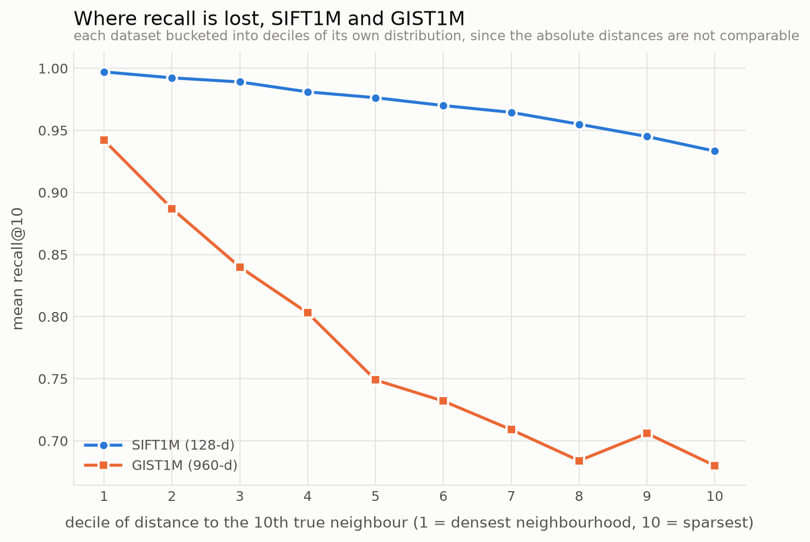

# Analysis: what breaks at 960 dimensions

Checkpoint 6. Everything here comes from re-running the frozen protocol of
[PROTOCOL.md](../PROTOCOL.md) on GIST1M — 1,000,000 vectors of 960 dimensions, 1,000
queries — with no parameter changed from the SIFT1M run. The grid is the same 90
configurations per side; the code is the same code.

## 1. The two index families fail completely differently

| best recall@10 reached | SIFT1M (128-d) | GIST1M (960-d) | change |
|---|---:|---:|---|
| HNSW, this project | 0.9994 | 0.9884 | −1.1 points |
| HNSW, FAISS | 0.9994 | 0.9905 | −0.9 points |
| IVF-PQ, this project | 0.7380 | **0.2821** | **−45.6 points** |
| IVF-PQ, FAISS | 0.7347 | **0.2804** | **−45.4 points** |

HNSW degrades **gracefully**: it still lands within 1.1 points of a 0.99920 ceiling, and
pays about 5x the latency to do it. Given enough `efSearch` the answer is still there.

IVF-PQ **collapses**: from three quarters of the true neighbours to barely a quarter. No
`nprobe` recovers it, because the loss is not search effort. And FAISS loses the same 45
points, which is the check that matters — this is a property of 8-bit product quantization
at k=10, not of this implementation.

### Why: dimensions per byte, not dimensions

A PQ code is `m` bytes whatever the dataset. Each of those bytes indexes 256 centroids that
must cover a subspace of `dim/m` dimensions:

| | dim/m at m=32 | 256 centroids in that subspace |
|---|---:|---|
| SIFT1M | 4 | dense — about 4 divisions per axis |
| GIST1M | 30 | hopeless — 256 points cannot tile 30 dimensions at any resolution |

Nothing about 960 dimensions is intrinsically hard for an inverted file; what is hard is
being asked to describe 30 dimensions with one byte. The compression ratio is held fixed
across datasets by the protocol, so the *resolution* is what gives.

Product quantization's independence assumption also fares worse. SIFT's 128 dimensions are
16 spatial cells × 8 gradient orientations, so a contiguous group of 8 is one cell's
histogram and genuinely coheres. GIST is a global descriptor whose components correlate
across any contiguous split. This is precisely the case OPQ addresses — it learns a rotation
that decorrelates the subspaces before quantizing — and it is the single most valuable thing
this project does not implement.

## 2. Recall loss concentrates on queries in sparse regions, and far more so at 960-d

<picture>
  <source media="(prefers-color-scheme: dark)" srcset="plots/recall-by-sparsity-dark.png">
  
</picture>

Queries are bucketed into deciles by their distance to their own 10th true neighbour, which
is the natural measure of how isolated a query is. Each dataset is bucketed against its own
distribution, because SIFT's L2 distances run 140–280 and GIST's run 0.9–1.4 and comparing
them on an absolute axis would be meaningless.

| | densest decile | sparsest decile | spread |
|---|---:|---:|---:|
| SIFT1M | 0.997 | 0.933 | 6.4 points |
| GIST1M | 0.942 | 0.681 | **26.1 points** |

Failures are not spread evenly over queries — they concentrate on queries sitting in sparse
regions, and **the concentration is four times stronger at 960 dimensions**. The mechanism is
the one that makes high-dimensional search hard in general: as dimension grows, the ratio
between the distance to the 10th neighbour and the distance to the 100th shrinks, so the
gradient a greedy graph walk is following gets flatter. A query in a dense neighbourhood
still has a clear downhill direction. A query in a sparse one, at 960 dimensions, is walking
on something nearly level, and the search terminates on a plateau rather than at a minimum.

## 3. Orphans appear only at high dimension

`GraphDiagnostics` counts nodes with no incoming layer-0 edge. Nothing points at them, so no
search can return them at any `efSearch` — a structural recall floor rather than a tuning
problem.

| | queries with an unreachable true neighbour |
|---|---:|
| SIFT1M, 10,000 queries | **0** |
| GIST1M, 1,000 queries | **10 (1.0%)** |

At 128 dimensions the graph is fully connected and orphans do not survive to a million
nodes. At 960 they do. The heuristic that keeps an edge only when no already-selected
neighbour is closer to the candidate prunes hardest exactly where distances are least
distinguishable, so an outlier in high-dimensional space ends up with few edges of its own
and its back-edges are the first dropped when its distant neighbours fill up.

One percent of GIST queries therefore have at least one true neighbour that this index
*cannot* return, whatever it is asked to do.

## 4. Neighbour selection: the ablation

Plain nearest-M against the pruning heuristic, everything else held at M=16,
efConstruction=200.

| efSearch | SIFT heuristic | SIFT nearest-M | lost | GIST heuristic | GIST nearest-M | lost |
|---:|---:|---:|---:|---:|---:|---:|
| 16 | 0.8170 | 0.7209 | 0.096 | 0.5069 | 0.3821 | 0.125 |
| 64 | 0.9704 | 0.9025 | 0.068 | 0.7732 | 0.5916 | **0.182** |
| 256 | 0.9979 | 0.9705 | 0.027 | 0.9256 | 0.7504 | **0.175** |
| 512 | 0.9992 | 0.9812 | 0.018 | 0.9633 | 0.8008 | **0.163** |

The heuristic is worth having on both datasets, but **what it buys is qualitatively
different on each**.

On SIFT the damage from nearest-M **shrinks as `efSearch` grows** — 0.096 at ef=16 down to
0.018 at ef=512. A worse graph costs recall, but searching harder buys most of it back. The
edges the heuristic would have kept were shortcuts; without them the search takes a longer
route to the same place.

On GIST the damage **does not shrink** — it is 0.125 at ef=16 and still 0.163 at ef=512,
having peaked in between. Quadrupling the beam four times over recovers nothing. The missing
edges were not shortcuts, they were the only route: without them the true neighbours are in
a part of the graph the search cannot reach from where it starts, and no amount of beam width
fixes an edge that does not exist.

That is the sharpest statement of what neighbour selection is for. At low dimension it is an
optimization. At high dimension it is what keeps the graph connected at all.

## 5. What it costs to get the recall back

Same code, same parameters, both datasets:

| M=16, efC=200 | SIFT1M | GIST1M | slowdown |
|---|---:|---:|---:|
| ef=64 | 0.9704 @ 92 µs | 0.7732 @ 449 µs | 4.9x |
| ef=512 | 0.9992 @ 533 µs | 0.9633 @ 2556 µs | 4.8x |

GIST needs `ef=512` to reach roughly what SIFT reaches at `ef=128`, and each of those
queries costs about five times as much. The two effects compound rather than trade off:
recall falls at fixed effort, *and* the effort needed to recover it rises.

## 6. The Java/FAISS gap is not one number, it has three gradients

The HNSW comparison reverses between datasets, and reading it as a single ratio hides what
is going on. Mean-latency ratio, this project divided by FAISS — below 1 means this project
is faster:

| GIST1M, ef | M=8 | M=16 | M=32 |
|---:|---:|---:|---:|
| 16 | 1.49 | 1.35 | 1.07 |
| 64 | 1.47 | 1.28 | 0.98 |
| 512 | 1.30 | 1.26 | **0.82** |

On SIFT1M the same ratio runs 0.63–0.90 everywhere. Three consistent gradients explain both
tables at once:

* **More dimensions → FAISS gains.** Distance work per candidate grows while bookkeeping per
  candidate does not. The distance kernel is FAISS's advantage.
* **More `efSearch` → this project gains.** More candidates pass through the visited stamps
  and the two heaps. That bookkeeping is this project's advantage, which is exactly what
  steps 2 and 3 of [hnsw-optimization.md](hnsw-optimization.md) bought.
* **More `M` → this project gains.** A higher degree means more pending neighbours per hop,
  and the software prefetch of step 5 issues their loads together. At 960 dimensions each
  miss costs 3,840 bytes, so prefetching pays most where misses are dearest.

SIFT is the regime where all three favour this implementation. GIST at M=8 is the worst
case — expensive distances, little to prefetch — and GIST at M=32 is back to parity.

**This also supplies the control the SIFT-only data could not.** Sweeping `M` alone would
confound kernel work, hop count and cache behaviour. Sweeping dimension at fixed `M` and
`efSearch` moves the kernel/bookkeeping ratio while leaving graph structure and beam
mechanics essentially alone, so running both datasets separates the axes that a single
dataset cannot.

## 7. What this says about choosing an index

* **At 128 dimensions, both work and they answer different questions.** HNSW gets 0.9994 in
  165 µs and needs 626 MiB; IVF-PQ gets 0.74 in 649 µs and needs 37 MiB. If the vectors fit
  in memory, use the graph. If they do not, the quantizer is not a compromise, it is the only
  option that runs at all.
* **At 960 dimensions the choice is made for you.** IVF-PQ at these code sizes returns a
  quarter of the true neighbours and cannot be tuned out of it. HNSW still works; it costs
  5x more and it needs a wider beam.
* **The failure is not uniform, so an average recall hides it.** A GIST index reporting 0.77
  mean recall is returning 0.94 for queries in dense neighbourhoods and 0.68 for queries in
  sparse ones. If the queries that matter are the unusual ones, the mean is the wrong number
  to have looked at.
